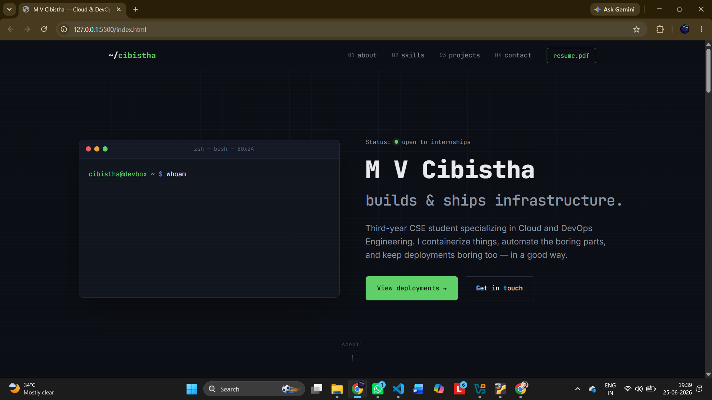
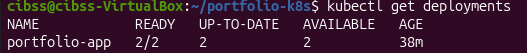
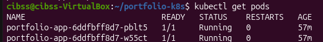
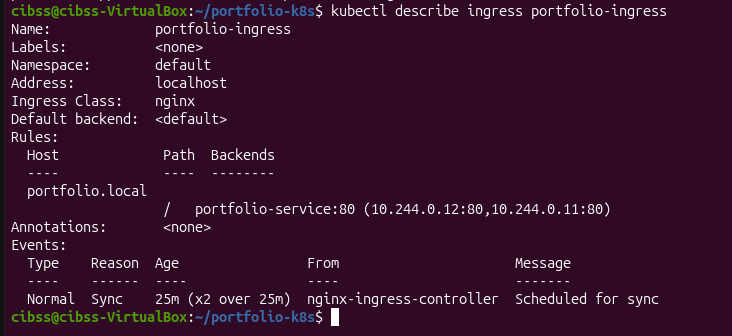
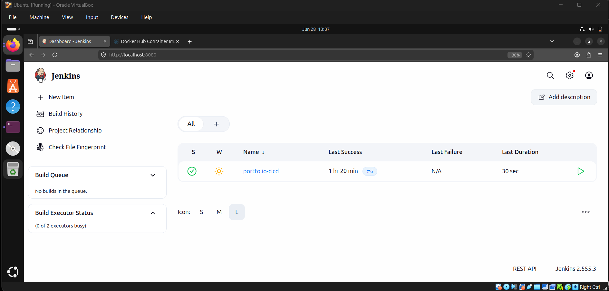
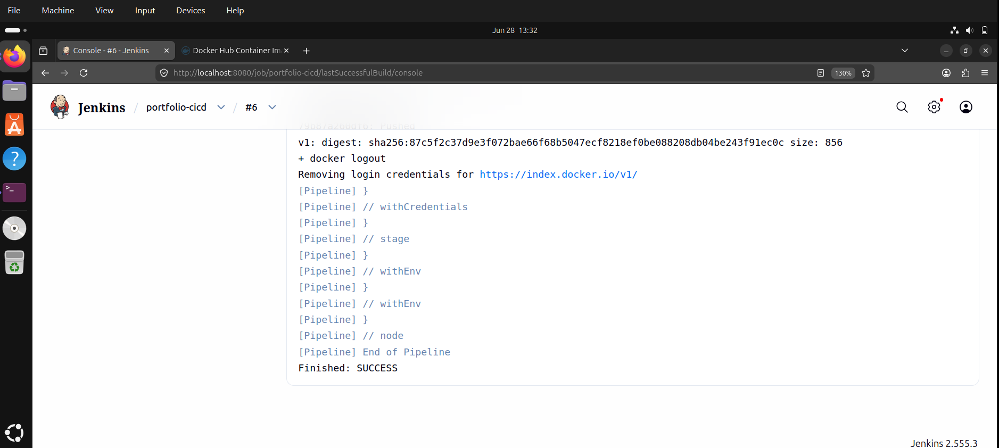
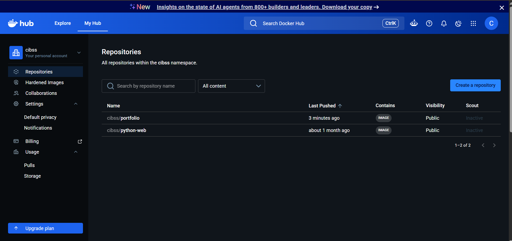

# 🚀 Portfolio Website CI Pipeline with Jenkins, Docker & Kubernetes


A complete DevOps project demonstrating how a portfolio website can be automatically built, containerized, and published to Docker Hub using **Jenkins Declarative Pipelines**, while being deployed on **Kubernetes (Kind)**.

This project was built to gain practical hands-on experience with Docker, Kubernetes, Jenkins, CI Pipelines, and modern DevOps workflows.

---

# 📖 Table of Contents

- Project Overview
- Architecture
- Technologies Used
- Project Structure
- CI Pipeline Workflow
- Kubernetes Deployment
- Project Demonstration
- How to Run
- Key Learnings
- Challenges Faced
- Future Improvements
- Author

---

# 📌 Project Overview

In a real software development environment, developers continuously update application code.

Instead of manually:

- Building Docker images
- Pushing images to Docker Hub
- Managing image versions

this project automates the **Continuous Integration (CI)** process using Jenkins.

Whenever the latest code is available in GitHub, Jenkins can automatically:

- Clone the repository
- Build the Docker image
- Version the image using Jenkins Build Number
- Push the image securely to Docker Hub
- Clean unused Docker images

The application is deployed separately on a local Kubernetes (Kind) cluster.

---

# 🏗️ Project Architecture

```
             Developer
                 │
                 ▼
          Push Code to GitHub
                 │
                 ▼
            Jenkins Pipeline
                 │
        ┌────────┼────────┐
        │        │        │
        ▼        ▼        ▼
    Checkout   Build    Push Image
                 │
                 ▼
            Docker Hub
                 │
                 ▼
      Kubernetes pulls image
                 │
                 ▼
        Portfolio Website
```

---

# 🛠️ Technologies Used

| Technology | Purpose |
|------------|---------|
| Jenkins | Continuous Integration |
| Docker | Containerization |
| Docker Hub | Docker Image Registry |
| Kubernetes (Kind) | Container Orchestration |
| Git | Version Control |
| GitHub | Source Code Hosting |
| HTML/CSS/JavaScript | Portfolio Website |
| Ubuntu | Development Environment |

---

# 📂 Project Structure

```
portfolio-kubernetes-deployment/

│
├── Dockerfile
├── Jenkinsfile
├── portfolio-deployment.yaml
├── portfolio-service.yaml
├── portfolio-ingress.yaml
├── index.html
├── style.css
├── script.js
├── Screenshots/
│   ├── 01-portfolio-website.png
│   ├── 02-kubernetes-deployment.png
│   ├── 03-kubernetes-pods.png
│   ├── 04-kubernetes-ingress.png
│   ├── dockerhub.png
│   ├── jenkins-dashboard.png
│   └── pipeline-success.png
└── README.md
```

---

# 🔄 Jenkins CI Pipeline Workflow

The Jenkins Declarative Pipeline consists of multiple automated stages.

---

## ✅ Stage 1 — Checkout

Fetches the latest source code from GitHub.

```
GitHub
   ↓
Checkout Source Code
```

---

## ✅ Stage 2 — Build Docker Image

Builds a Docker image from the Dockerfile.

Instead of using a fixed tag:

```
portfolio:v1
```

the pipeline uses

```
${BUILD_NUMBER}
```

Example:

```
cibss/portfolio:1

cibss/portfolio:2

cibss/portfolio:3
```

This makes every build uniquely versioned.

---

## ✅ Stage 3 — Push Docker Image

The pipeline securely logs into Docker Hub using Jenkins Credentials.

```
Docker Login

↓

Push Image

↓

Docker Logout
```

No Docker credentials are stored inside the Jenkinsfile.

---

## ✅ Stage 4 — Cleanup

Unused Docker images are automatically removed.

```
docker image prune -f
```

This prevents Jenkins from consuming excessive storage after multiple builds.

---

# 🔐 Secure Credentials

Docker Hub credentials are securely stored inside Jenkins.

The pipeline accesses them using

```groovy
withCredentials(...)
```

instead of storing usernames or passwords inside the repository.

This follows DevOps security best practices.

---

# ☸️ Kubernetes Deployment

The application is deployed using Kubernetes.

The deployment includes:

- Deployment
- ReplicaSets
- Multiple Pods
- Kubernetes Service
- Ingress Configuration

The Kubernetes Deployment pulls the Docker image from Docker Hub.

---

# 📸 Project Demonstration

## 🌐 Portfolio Website



---

## ☸️ Kubernetes Deployment



---

## ☸️ Running Pods



---

## 🌍 Kubernetes Ingress



---

## ⚙️ Jenkins Dashboard

Successful Jenkins Job



---

## 🚀 Successful Jenkins Pipeline

Pipeline completed successfully.



---

## 🐳 Docker Hub Repository

Versioned Docker Images



---

# ▶️ How to Run

Clone the repository

```bash
git clone https://github.com/CloudWithC/portfolio-kubernetes-deployment.git
```

Build Docker image

```bash
docker build -t portfolio:v1 .
```

Push image

```bash
docker push <your-dockerhub-username>/portfolio:v1
```

Deploy to Kubernetes

```bash
kubectl apply -f portfolio-deployment.yaml

kubectl apply -f portfolio-service.yaml

kubectl apply -f portfolio-ingress.yaml
```

---

# 📚 Key Learnings

This project provided hands-on experience with:

- Docker Images
- Docker Containers
- Dockerfile
- Docker Hub
- Jenkins Declarative Pipelines
- Jenkins Credentials
- Custom Jenkins Docker Image
- Docker Socket Mounting
- Kubernetes Deployments
- ReplicaSets
- Services
- Ingress
- Continuous Integration (CI)
- Image Versioning using Jenkins Build Numbers
- Pipeline Automation
- Docker Image Cleanup

---

# ⚠️ Challenges Faced

While building this project, several real-world DevOps challenges were encountered and resolved.

Examples include:

- Installing Docker CLI inside Jenkins
- Building a custom Jenkins Docker image
- Configuring Docker socket permissions
- Securely storing Docker Hub credentials
- Publishing Docker images from Jenkins
- Understanding communication between Dockerized Jenkins and a local Kind Kubernetes cluster

> **Note:**  
> The project currently automates the **Continuous Integration (CI)** process.  
> Automatic Kubernetes deployment from Jenkins was intentionally not implemented because the Jenkins container and the local Kind cluster communicate through different localhost network namespaces. In a production environment, Jenkins would communicate with Kubernetes using a reachable API server or a GitOps workflow.

---

# 🚀 Future Improvements

Planned enhancements include:

- GitHub Webhooks
- Continuous Deployment (CD)
- Automatic Kubernetes Rollouts
- Helm Charts
- SonarQube Integration
- Automated Testing
- Slack/Email Notifications
- Deploying on AWS
- GitOps using ArgoCD


